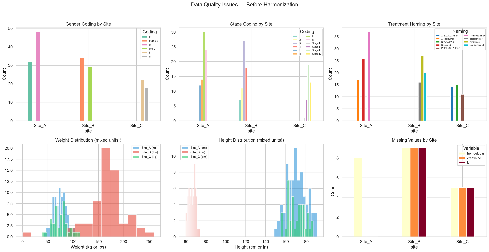
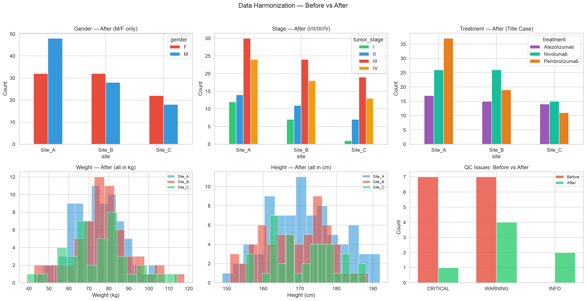

# 🧪 Clinical Data QC Toolkit

[](https://python.org)
[]()
[](LICENSE)

> Python toolkit for **automated quality control and harmonization** of multi-center clinical datasets, typical of real-world oncology trials.

**Author**: [Zahia Yanes](https://www.linkedin.com/in/zahia-yanes) — Health Data & AI Engineer

---

## 🎯 Objective

Clinical trials collect data from multiple hospital sites, each with their own
conventions, formats, and data quality standards. This toolkit automates:

- **Detection** of cross-site data quality issues
- **Harmonization** into a unified, analysis-ready format
- **Reporting** with full traceability of every transformation

---

## 🏗️ Pipeline Architecture

```
┌──────────────┐     ┌──────────────┐     ┌──────────────┐     ┌──────────────┐
│  Multi-site  │────▶│  Automated   │────▶│   Data       │────▶│  Clean       │
│  Raw Data    │     │  QC Checks   │     │  Harmonizer  │     │  Dataset     │
│  (3 sites)   │     │  (14 issues) │     │  (8 steps)   │     │  + Report    │
└──────────────┘     └──────────────┘     └──────────────┘     └──────────────┘
```

---

## 🔍 Data Quality Issues Detected

The toolkit simulates and detects issues typical of real multi-center studies:

| Issue Type | Example | Severity |
|-----------|---------|----------|
| Inconsistent date formats | DD/MM/YYYY vs MM/DD/YYYY vs YYYY-MM-DD | 🟡 WARNING |
| Mixed measurement units | kg vs lbs, cm vs inches | 🔴 CRITICAL |
| Inconsistent gender coding | M/F vs Male/Female vs m/f | 🟡 WARNING |
| Inconsistent stage coding | I/II vs 1/2 vs Stage I/Stage II | 🟡 WARNING |
| Inconsistent treatment naming | Pembrolizumab vs PEMBROLIZUMAB | 🟡 WARNING |
| Duplicate records | Same patient appearing twice | 🔴 CRITICAL |
| Impossible values | Negative age, zero weight | 🔴 CRITICAL |
| Missing data patterns | Site-specific missing rates (10-15%) | 🟡 WARNING |
| Future dates | Enrollment date in 2026 | 🔴 CRITICAL |

### Severity Levels

| Level | Meaning | Action |
|-------|---------|--------|
| 🔴 CRITICAL | Data is incorrect — will corrupt analysis | Must fix before any analysis |
| 🟡 WARNING | Data is suspicious — potential bias | Investigate and document |
| 🔵 INFO | Minor note — acceptable | Log for traceability |

---

## 📊 Results

### Before Harmonization — Cross-site Inconsistencies



### After Harmonization — Unified Dataset



**Summary**: 7 out of 14 issues resolved automatically. Remaining issues
are missing values (cannot be fabricated) and flagged outliers (require
clinical review).

| Metric | Before | After |
|--------|--------|-------|
| Records | 183 | 180 |
| Duplicates | 3 | 0 |
| Gender codings | 6 | 2 |
| Stage codings | 12 | 4 |
| Treatment names | 9 | 3 |
| Weight units | 2 (kg, lbs) | 1 (kg) |
| CRITICAL issues | 7 | 1 |
| WARNING issues | 7 | 4 |

---

## 🔧 Harmonization Steps

The pipeline applies 8 standardization steps in order:

1. **Remove duplicates** — keep first occurrence
2. **Fix impossible values** — negative age, zero weight → NaN
3. **Standardize dates** — all sites → ISO format (YYYY-MM-DD)
4. **Flag future dates** — flag for manual review (not deleted)
5. **Harmonize gender** — M/F/Male/Female/m/f → M/F
6. **Harmonize tumor stage** — I/1/Stage I → I
7. **Harmonize treatment names** — all → Title Case
8. **Convert units** — lbs → kg, inches → cm

Every step is logged with timestamps for full audit trail compliance.

---

## 📂 Project Structure

```
clinical-data-qc-toolkit/
│
├── src/                              # Source code
│   ├── __init__.py
│   ├── data_simulator.py            # Multi-center data generator
│   ├── qc_checks.py                 # Automated QC checks (6 checks)
│   └── harmonizer.py                # Data harmonization pipeline
│
├── tests/                            # Unit tests
│   ├── __init__.py
│   └── test_qc_checks.py            # 19 tests for QC module
│
├── notebooks/                        # Analysis notebooks
│   └── 01_qc_demo.ipynb             # Full QC demo with visualizations
│
├── outputs/figures/                  # Generated figures
│   ├── 01_issues_before.png
│   └── 02_before_vs_after.png
│
├── requirements.txt                  # Python dependencies
├── .gitignore
└── README.md                         # This file
```

---

## 🚀 Getting Started

### Installation

```bash
# Clone the repository
git clone https://github.com/ZahiaYanes/clinical-data-qc-toolkit.git
cd clinical-data-qc-toolkit

# Create and activate environment
conda create -n qc-toolkit python=3.12
conda activate qc-toolkit

# Install dependencies
pip install -r requirements.txt
```

### Usage

```bash
# Generate synthetic multi-center data
python src/data_simulator.py

# Run QC checks
python src/qc_checks.py

# Run full pipeline (QC → Harmonize → Re-QC)
python src/harmonizer.py

# Run tests
python -m pytest tests/ -v

# Open demo notebook
jupyter notebook notebooks/01_qc_demo.ipynb
```

---

## 🧪 Tests

```bash
python -m pytest tests/ -v
```

```
tests/test_qc_checks.py::TestQualityReport::test_empty_report PASSED
tests/test_qc_checks.py::TestMissingValues::test_no_missing PASSED
tests/test_qc_checks.py::TestDuplicates::test_detects_duplicates PASSED
tests/test_qc_checks.py::TestValueRanges::test_detects_negative_age PASSED
...
19 passed in 0.25s
```

---

## 🛠️ Tech Stack

| Tool | Usage |
|------|-------|
| **Python** (pandas, numpy) | Data manipulation |
| **matplotlib, seaborn** | Visualizations |
| **pytest** | Unit testing |
| **Jupyter** | Interactive demo |

---

## 💡 Clinical Data Engineering Lessons

1. **Never assume consistency** across clinical sites
2. **Always validate units** before merging multi-center data
3. **Document every transformation** for audit trail compliance
4. **Flag, don't delete** uncertain values — clinical review is essential
5. **Test your QC code** — a buggy QC pipeline is worse than no QC

---

## 📚 References

1. **Du Terrail, J.O. [...] Yanes, Z.** et al. (2025). FedECA: federated external
   control arms for causal inference. *Nature Communications*, 16(1).
   [DOI](https://doi.org/10.1038/s41467-025-62525-z)
2. ICH E6(R2) — Good Clinical Practice Guidelines
3. CDISC Standards for Clinical Data

---

## 📝 License

MIT License — Copyright (c) 2025 Zahia Yanes

---

## 👤 Author

**Zahia Yanes** — Health Data & AI Engineer

- 🔗 [LinkedIn](https://www.linkedin.com/in/zahia-yanes)
- 🐙 [GitHub](https://github.com/ZahiaYanes)
- 📧 zahia.yanes@gmail.com